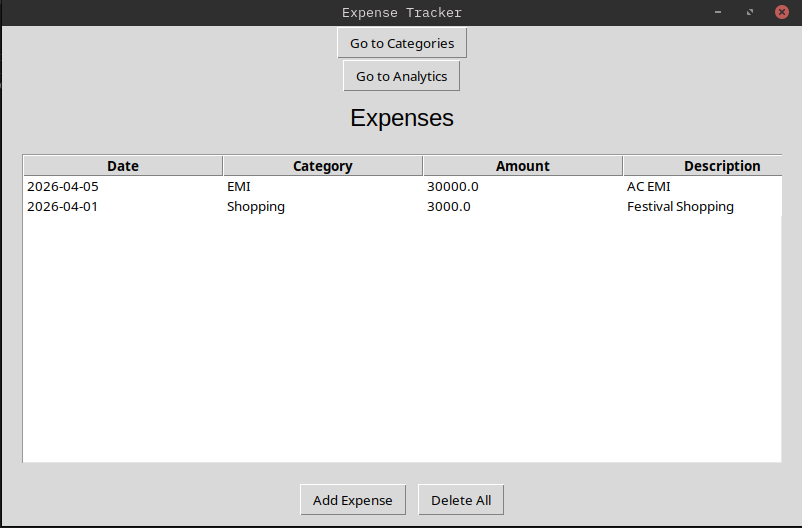
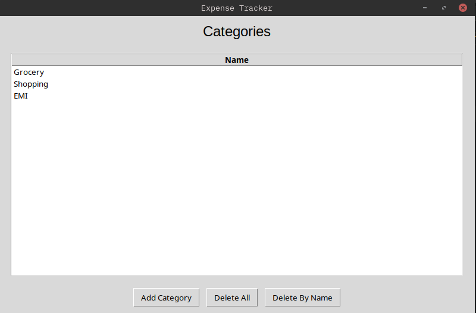
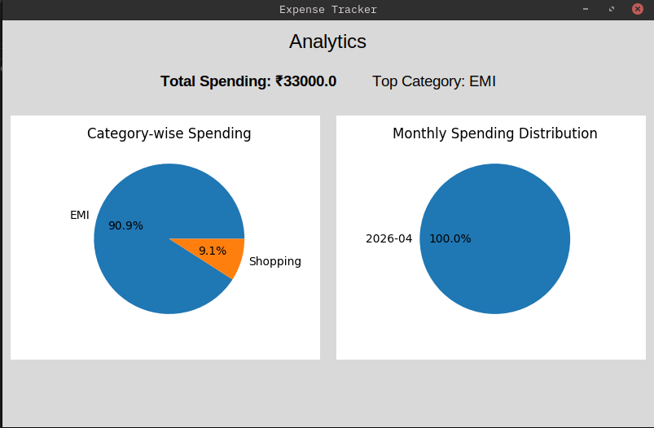

# Expensi

Expensi is a simple GUI based expense tracker. Some of its key features are:
- It stores data in a .csv file in the directory `assets/data`. No database is involved.
- It prints and stores simple analytics charts in the directory `assets/images`. No bucket storage of any sorts is involved.
- Expenses can be stored, viewed or deleted. All expenses are accounted into some categories, which will help analyze the expenses better.
- These categories can be viewed and managed seperately.
- Anaytics are run for 4 key features:
  - Total Spending
  - Month-wise account of money spent
  - Category-wise account 
  - Highest spending category.

## Folder Structure

```
.
├── assets
│   ├── data
│   │   ├── categories.csv
│   │   └── expenses.csv
│   └── images
│       ├── analytics_example.png
│       ├── categories_example.png
│       └── expenses_example.png
├── __init__.py
├── main.py
├── models
│   ├── analytics.py
│   ├── category.py
│   └── expense.py
├── repositories
│   ├── analytics_repository.py
│   ├── category_repository.py
│   └── expense_repository.py
├── requirements.txt
├── ui
│   ├── analytics_page.py
│   ├── category_page.py
│   └── expense_page.py
└── utils
    └── csv_utils.py
```

## Models
The models directory contains the object-oriented design models of 3 main models for this application. Each model is encapsulated, and contains simple fields that map to types. They are:

- **Expense**: It is the core object. Every expense object has a data, amount, category and a description. 
- **Category**: This object is associated with expense. It only has a name.
- **Analytics**: This model is more of a functional service that extracts simple analytics from the expenses.

## Repositories
Each of these repositories maps to model objects. The repository classes allow the model's state to persist in .csv files in the folder `assets/data`. They contain read, write and delete methods for these .csv files. Each models maps to a .csv file in the folder, except analytics. Analytics uses `matplotlib` to extract and plot figures based on the analytics model's results. It always returns an in-memory figure object, or plain data.

## Utils
Utils contains only one file for csv utilities. It leverages the `csv` module in python for handing csv-related utilities for all the repositories. Here are the methods in a gist. All methods are static:

- `ensure_file_exists` checks if the filepath passed to it exists, if it does not exist, it creates it.
- `read_all` reads the filepath and returns a list of dictionaries, which contains the header mapped to the row data.
- `append_row` writes a row data to the .csv filepath. It receives this data as a dictionary of headers mapped to rows.
- `overwrite` overwrites all the rows to a new list of dictionaries passed to it as an argument.

## UI
UI files contain the GUI pages and window. This window is written using the `tkinter` module in python. Here, all the repositories are injected and used to interface the functionality to the user. Here's the demo UI:






## Future Scope
This project can be expanded in various directions. Here are some future ideas which will be implemented:

- More analytics can be feature engineered, such as day-of-the week more active, days since last tractions, running average amount, type of transaction, automatic category detection, etc.
- User model can be introduced, and as a result, transactions per user model can be engineered. Also, splitting of expenses feature can be introduced.
- Nested category chains, such as Transportation -> Car -> Maintainance provide more context to the user than description.