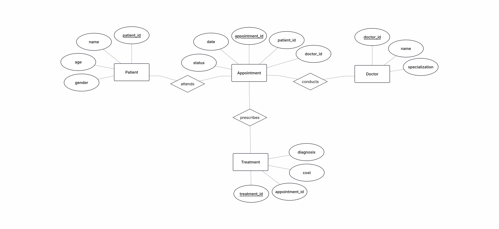
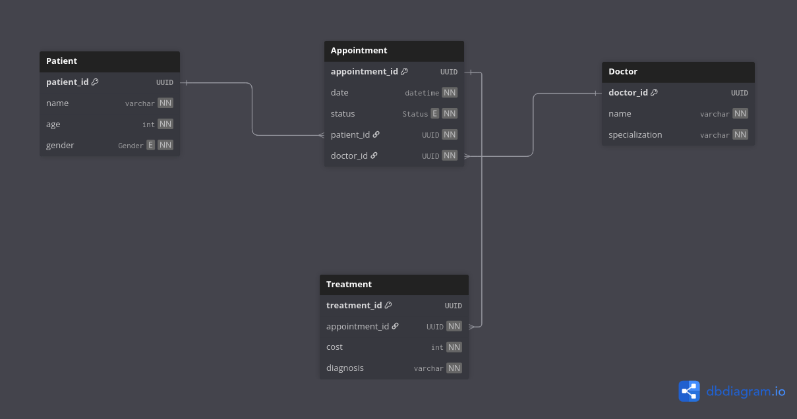

# Hospital Management &amp; Patient Analytics System

## Problem Statement
Hospitals need efficient systems to manage patient records and analyze treatment data.

## Objectives
- Design a database to store patient, doctor, and treatment data
- Perform analysis on hospital operations

## Database Tables
- Patients (patient_id, name, age, gender)
- Doctors (doctor_id, name, specialization)
- Appointments (appointment_id, patient_id, doctor_id, date)
- Treatments (treatment_id, patient_id, diagnosis, cost)

## Key Tasks
- Find most consulted doctors
- Calculate total revenue per month
- Identify most common diseases
- Track patient visit frequency
- Analyze doctor performance

## Solution

### Approach
- I found a small semantical problem. I felt that a sequence exists in these tables, which is the fact that a treatment must be precribed for an appointment.
- Thus, I chose `Appointment` to be the central table on which every other table depends.
- I choose MySQL as my database, and decided that the tasks can be modelled as stored procedures.

### ER-Diagram


#### Key Relationships
- Patient `Attends` Appointment
- Doctor `Conducts` Appointment
- Appointment `Prescribes` Treatment

### Relational Schema Diagram


#### Key Design Choices
- I have decided to model the primary keys as `UUIDs (Universally Unique Identifiers)`, instead of traditional auto-increment integer primary keys. Say the database is to be sharded, then two databases can have the same primary key. This will cause problems during merges and joins.
- Appointment is chosen as the central table, as the pipeline is - a patient books an appointment with a doctor, and a result of that appointment is a treatment.

### SQL Explanations
These are some explanations to some excerpts of the SQL file attached in this repository.

```SQL
CREATE TABLE Patient (
    patient_id CHAR(36) NOT NULL, -- UUID as CHAR(36)
    p_name VARCHAR(100) NOT NULL,
    age INT NOT NULL,
    gender ENUM("male", "female", "other") NOT NULL,
    PRIMARY KEY (patient_id)
);
```
- `UUID` is a 128-bit number. It is generated by the UNIX timestamp and that time, and some random bits. These 128 bits are mapped to 16 bytes, and represented like this:

> 8-4-4-4-12

- Thus, to accomodate for the 4 extra hyphens I have allocated size 36. 

```sql
DELIMITER $$

CREATE PROCEDURE AnalyzeDoctorPerformance()
BEGIN
    SELECT
        d.doctor_id,
        d.d_name,
        d.specialization,
        COUNT(a.appointment_id) AS total_appointments,
        COALESCE(SUM(t.cost), 0) AS total_revenue
    FROM Doctor d
    LEFT JOIN Appointment a
        ON d.doctor_id = a.doctor_id
    LEFT JOIN Treatment t
        ON a.appointment_id = t.appointment_id
    GROUP BY d.doctor_id, d.d_name, d.specialization
    ORDER BY total_revenue DESC, total_appointments DESC;
END$$

DELIMITER ;
```
- Typically, in MySQL `;` is the end-of-line symbol. But we change it to be `$$` by writing `DELIMITER $$`. 
- This is an example of a stored procuedure that analyzes the performance of all the doctors in the hospital. 
- `COALESCE()` returns the first non-null value in the list. In this case, a `LEFT JOIN` might produce `NULL` values. So, the SUM() may return `NULL`.